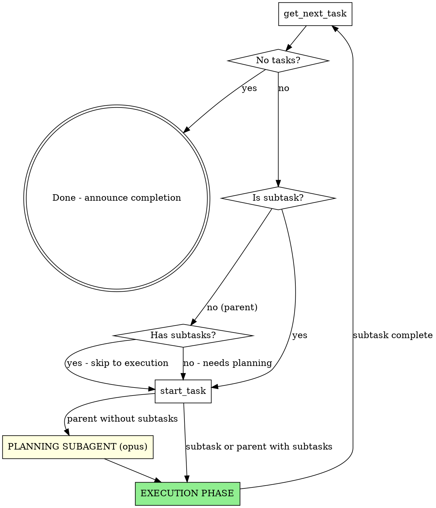

# Superpowers Workflow

## Overview

Execute tasks from the task manager MCP using superpowers patterns. For parent tasks without subtasks: create implementation plan as subtasks. For subtasks: execute using subagent-driven-development flow.

**Announce at start:** "Using superpowers-workflow to execute pending tasks."

**Requires:**
- Task manager MCP server running
- superpowers plugin installed

## The Process



### Phase 1: Get Task

1. Call `mcp__task-manager__get_next_task`
2. If no tasks available:
   - Commit task file changes: `git add tasks/ && git commit -m "chore: update task states"`
   - Announce "All tasks completed." and stop
3. If result is a subtask: go to Phase 3 (Execution)
4. If result is a parent task:
   - Call `mcp__task-manager__get_task` to check for existing subtasks
   - If has subtasks: go to Phase 3 (Execution)
   - If no subtasks: go to Phase 2 (Planning)

### Phase 2: Planning (parent tasks without subtasks)

**Goal:** Decompose the parent task into executable subtasks using an Opus subagent.

#### Step 1: Start Parent Task

Call `mcp__task-manager__start_task` with the parent task ID (main agent does this before dispatch).

#### Step 2: Dispatch Planning Subagent

Launch a Task tool subagent with:

```
Plan subtasks for Task #{id}: {title}
Priority: {priority}
Type: {type}

Description:
{parent task description}

---
Instructions:
1. Read relevant codebase files to understand context
2. Use AskUserQuestion if requirements are unclear
3. For each implementation task in your plan, call `mcp__task-manager__create_task`:
   - `title`: "Task N: [Component/Action]"
   - `description`: Full task spec (see format below)
   - `priority`: {priority} (same as parent)
   - `type`: {type} (same as parent)
   - `parent_id`: {id}

4. Report the subtasks you created

### Subtask Description Format

Each subtask description must be self-contained. Include:

**Files:**
- Create: `exact/path/to/file.ext`
- Modify: `exact/path/to/existing.ext`
- Test: `tests/exact/path/to/test.ext`

**Steps:**
1. Write failing test
2. Run test to verify failure: `[exact command]`
3. Implement minimal code
4. Run test to verify pass: `[exact command]`
5. Commit with message: `[exact message]`

**Code:**
[Include actual code snippets, not "add validation here"]

**Verification:**
`[exact verification command]`

### Planning Guidelines

- Design tasks to fit in subtask descriptions
- External files only for large examples/data (create in `docs/examples/` if needed)
- Each task should be completable by one subagent session
- Include everything the implementer needs - they have no other context
- Follow DRY, YAGNI, TDD principles
```

Use `subagent_type: general-purpose` and `model: opus`.

#### Step 3: Verify and Proceed

After the planning subagent returns:
1. Verify subtasks were created (subagent reports what it created)
2. Proceed to Phase 3 (Execution)

### Phase 3: Execution

For each subtask, use the superpowers:subagent-driven-development pattern:

#### Step 1: Start Subtask

1. Call `mcp__task-manager__start_task` with subtask ID
2. Call `mcp__task-manager__get_task` to get full subtask details

#### Step 2: Dispatch Implementer Subagent

Launch a Task tool subagent with:

```
Task #{id}: {title}
Priority: {priority}
Parent: Task #{parent_id}: {parent_title}

{subtask description from task manager}

---
Instructions:
- Use superpowers:test-driven-development for implementation
- Follow the steps exactly as written
- Commit when complete
- Report what you implemented
- IMPORTANT: do not complete the subtask via `mcp__task-manager__complete_task`, this will be done by the main agent
```

Use `subagent_type: general-purpose` and `model: sonnet`.

If implementer asks questions: answer them, then let them continue.

#### Step 3: Dispatch Spec Reviewer Subagent

After implementer completes, launch spec reviewer:

```
Review the implementation for Task #{id}: {title}

**Original Spec:**
{subtask description}

**Review Focus:**
- Does implementation match spec exactly?
- Nothing missing from spec?
- Nothing extra beyond spec?

Use superpowers:requesting-code-review patterns.
Report: APPROVED or list specific issues.
```

If issues found:
1. Dispatch implementer to fix specific issues
2. Re-run spec review
3. Max 3 iterations, then escalate to user

#### Step 4: Dispatch Code Quality Reviewer Subagent

After spec review passes:

```
Code quality review for Task #{id}: {title}

**Review Focus:**
- Code quality and patterns
- Error handling
- Test coverage
- No security issues

Use superpowers:requesting-code-review patterns.
Report: APPROVED or list specific issues (Important/Minor).
```

If Important issues found:
1. Dispatch implementer to fix
2. Re-run code quality review
3. Max 3 iterations, then escalate to user

#### Step 5: Complete Subtask

1. Call `mcp__task-manager__complete_task` with subtask ID
2. Parent task auto-completes when last subtask is done
3. Return to Phase 1 (get next task)

## Error Handling

### Subagent Failure

```
1. Do NOT complete the subtask
2. Report error to user with details
3. Ask: "Retry, skip this subtask, or intervene manually?"
```

### Planning Blocked

```
1. Use AskUserQuestion to clarify requirements
2. Do NOT create subtasks until requirements are clear
3. If task is too large: ask user to break it down first
```

### Workflow Interruption

```
- Current subtask stays in_progress
- Resume later with /execute-all
- Workflow picks up from get_next_task result
```

## Example Session

```
User: /execute-all

Claude: Using superpowers-workflow to execute pending tasks.

[Calls get_next_task]
Task #7: Add user authentication (priority: high, no subtasks)

[Calls start_task(7)]
Task #7 is now in_progress. No subtasks exist, entering planning phase.

Dispatching planning subagent (opus) to decompose task...

[Planning subagent creates subtasks]
Planning subagent: Created 3 subtasks:
- Task #8: "Task 1: Add User model" (parent: #7)
- Task #9: "Task 2: Add authentication middleware" (parent: #7)
- Task #10: "Task 3: Add login endpoint" (parent: #7)

Planning complete. 3 subtasks created. Starting execution.

[Calls get_next_task - returns Task #8]
[Calls start_task(8)]

Dispatching implementer subagent for Task #8: Add User model...

[Implementer completes]
Implementer: Created User model with email/password, added tests, committed.

Dispatching spec reviewer...
Spec reviewer: APPROVED - matches spec exactly.

Dispatching code quality reviewer...
Code reviewer: APPROVED - clean implementation, good test coverage.

[Calls complete_task(8)]
Task #8 completed.

[Calls get_next_task - returns Task #9]
... continues until all subtasks done ...

[After Task #10 completes]
Task #7 auto-completed (all subtasks done).

[Calls get_next_task - no tasks]
All tasks completed.

[Commits task files]
git add tasks/ && git commit -m "chore: update task states"

Summary:
- Task #7: Add user authentication - DONE
  - Task #8: Add User model - DONE
  - Task #9: Add authentication middleware - DONE
  - Task #10: Add login endpoint - DONE
```

## Remember

- Always start tasks before working on them
- Always complete tasks after finishing (never mark incomplete work done)
- Use superpowers patterns for all subagent work
- Provide full context to subagents (they have no shared memory)
- Stop on failure, escalate to user
- Task manager handles parent auto-completion
- **Commit task files at workflow end:** When all tasks are completed, run `git add tasks/ && git commit -m "chore: update task states"` to version-control task state changes
