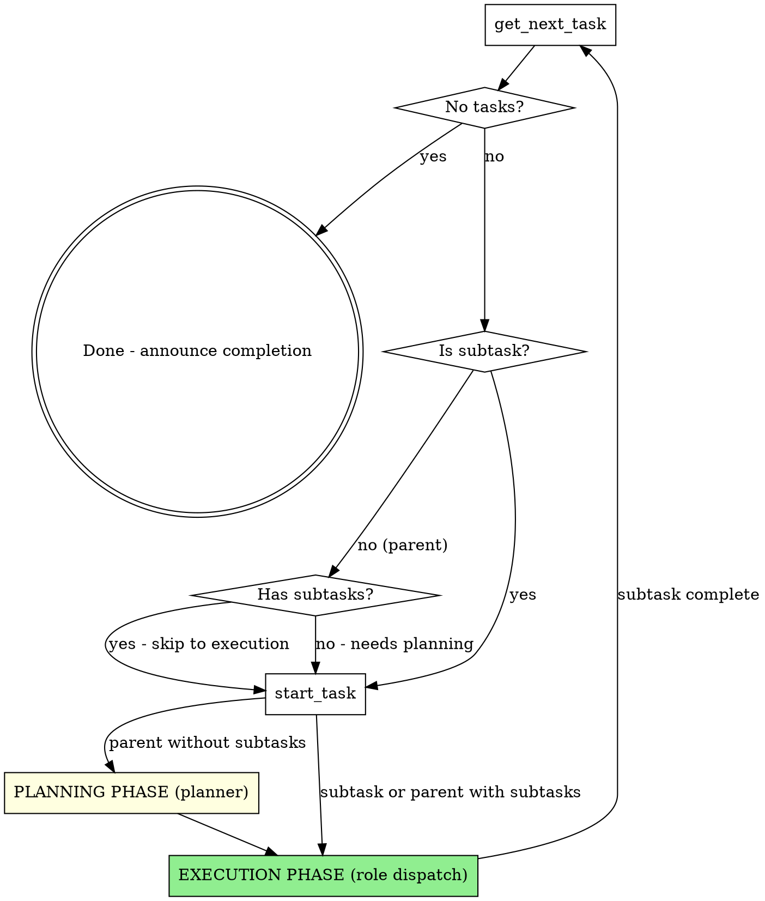

# Superpowers Workflow

## Overview

Execute tasks from the task manager MCP using installed `mcp-task-manager` role agents.

These agents are typically discovered through the Codex install layout described in `.codex/INSTALL.md`, usually at `~/.agents/agents/mcp-task-manager/`. Do not assume the active workspace itself provides the live agent definitions.

- Parent tasks without subtasks dispatch `planner`.
- Executable subtasks dispatch `coder`.
- Dispatch `reviewer` only when the task explicitly calls for review work or the user asks for an independent review.

This skill is the workflow controller. It owns task selection, task state changes, fallback decisions, phase transitions, and communication between role agents and the user when needed. It should orchestrate only, not add extra review passes or other busy work beyond what the task requires.

**Announce at start:** "Using superpowers-workflow to execute pending tasks."

**Requires:**
- Task manager MCP server running
- superpowers plugin installed

## Agent Resolution Policy

For each role, resolve agents in this order:

1. Installed `mcp-task-manager` role agent discovered by Codex, typically via `~/.agents/agents/mcp-task-manager/`
2. Another available role-appropriate agent
3. Default agent

Never silently downgrade.

If the preferred installed task-manager agent cannot be used, stop and ask the user which fallback to allow before continuing. Make the downgrade explicit so the user understands the workflow is leaving the intended task-manager guardrails.

Apply this rule independently for:

- planning fallback for `planner`
- implementation fallback for `coder`
- review fallback for `reviewer`

## Model Selection Policy

Use role-level model guidance rather than hardcoded vendor-specific mappings.

- `planner`: prefer the most capable available reasoning model, usually with high reasoning effort
- `reviewer`: prefer the most capable available reasoning model, usually with high reasoning effort
- `coder`: prefer a quicker model for bounded mechanical work, but escalate to a stronger model for multi-file integration, ambiguous changes, or debugging-heavy tasks

If `coder` becomes blocked because the current model is too weak for the task, re-dispatch with a stronger model before escalating to the user, unless the blocker is missing context rather than model capability.

## The Process


```dot
digraph workflow {
    rankdir=TB;

    "get_next_task" [shape=box];
    "No tasks?" [shape=diamond];
    "Done - announce completion" [shape=doublecircle];
    "Is subtask?" [shape=diamond];
    "Has subtasks?" [shape=diamond];
    "start_task" [shape=box];
    "PLANNING PHASE (planner)" [shape=box style=filled fillcolor=lightyellow];
    "EXECUTION PHASE (role dispatch)" [shape=box style=filled fillcolor=lightgreen];

    "get_next_task" -> "No tasks?";
    "No tasks?" -> "Done - announce completion" [label="yes"];
    "No tasks?" -> "Is subtask?" [label="no"];
    "Is subtask?" -> "start_task" [label="yes"];
    "Is subtask?" -> "Has subtasks?" [label="no (parent)"];
    "Has subtasks?" -> "start_task" [label="yes - skip to execution"];
    "Has subtasks?" -> "start_task" [label="no - needs planning"];
    "start_task" -> "PLANNING PHASE (planner)" [label="parent without subtasks"];
    "start_task" -> "EXECUTION PHASE (role dispatch)" [label="subtask or parent with subtasks"];
    "PLANNING PHASE (planner)" -> "EXECUTION PHASE (role dispatch)";
    "EXECUTION PHASE (role dispatch)" -> "get_next_task" [label="subtask complete"];
}
```

### Phase 1: Get Task

1. Call `mcp__task-manager__get_next_task`
2. If no tasks available:
   - Commit task file changes: `git add tasks/ && git commit -m "chore: update task states"`
   - Announce "All tasks completed." and stop
3. If result is a subtask: go to Phase 3 (Execution)
4. If result is a parent task:
   - Call `mcp__task-manager__get_task` to check for existing subtasks
   - If it has subtasks: go to Phase 3 (Execution)
   - If it has no subtasks: go to Phase 2 (Planning)

### Phase 2: Planning (parent tasks without subtasks)

**Goal:** Decompose the parent task into executable subtasks using the resolved `planner` agent.

#### Step 1: Start Parent Task

Call `mcp__task-manager__start_task` with the parent task ID before dispatch.

#### Step 2: Resolve Planning Agent

Prefer the installed `mcp-task-manager` `planner` agent.

If it cannot be used:
- do not continue automatically
- ask the user which fallback to allow
- only proceed after the user confirms the fallback choice

#### Step 3: Dispatch `planner`

Launch the planning agent with:

```text
Plan subtasks for Task #{id}: {title}
Priority: {priority}
Type: {type}

Description:
{parent task description}

Context:
- You are the planning phase only.
- Use `writing-plans` when converting approved intent into executable subtasks or plan structure.
- Keep scope aligned with the parent task.
- Do not implement code.
- If requirements are unclear, report `NEEDS_CONTEXT` with the missing information.

For each implementation task in your plan, call `mcp__task-manager__create_task`:
- `title`: "Task N: [Component/Action]"
- `description`: Full task spec
- `priority`: {priority}
- `type`: {type}
- `parent_id`: {id}

Each subtask description must be self-contained and include:
- Files
- Steps
- Code guidance
- Verification command
- Commit message

Report the subtasks you created.
```

#### Step 4: Verify and Proceed

After `planner` returns:
1. If it reports `NEEDS_CONTEXT`, get clarification before proceeding.
2. Verify subtasks were created.
3. Proceed to Phase 3 (Execution).

### Phase 3: Execution

For each executable subtask, dispatch the role agent the task actually requires. Most implementation subtasks go to `coder`. Use `reviewer` only when the task explicitly asks for review work or the user requests an independent review.

#### Step 1: Start Subtask

1. Call `mcp__task-manager__start_task` with the subtask ID.
2. Call `mcp__task-manager__get_task` to get the full subtask details.

#### Step 2: Resolve `coder`

Prefer the installed `mcp-task-manager` `coder` agent.

If it cannot be used:
- stop before dispatch
- ask the user which fallback to allow
- continue only after the user confirms

#### Step 3: Dispatch `coder`

Launch the coding agent with:

```text
Task #{id}: {title}
Priority: {priority}
Parent: Task #{parent_id}: {parent_title}

{subtask description from task manager}

Instructions:
- You are the execution phase only.
- Use relevant execution skills such as `test-driven-development`, `systematic-debugging`, and `verification-before-completion` when applicable.
- Follow the task steps exactly as written.
- Report one of: `DONE`, `DONE_WITH_CONCERNS`, `NEEDS_CONTEXT`, `BLOCKED`.
- Do not complete the task-manager task; the workflow controller handles task state.
```

If `coder` reports:
- `DONE`: complete the subtask unless an explicit review pass is required
- `DONE_WITH_CONCERNS`: read the concerns, address any scope or correctness questions, then complete the subtask unless an explicit review pass is required
- `NEEDS_CONTEXT`: provide the missing context and re-dispatch
- `BLOCKED`: stop and escalate with the blocker

If no review pass is required, skip to Step 6.

#### Step 4: Optional `reviewer` dispatch

Dispatch `reviewer` only when the task explicitly requires review work or the user requests an independent review. The controller should not add automatic review loops to every coding task.

If it cannot be used:
- stop before dispatch
- ask the user which fallback to allow
- continue only after the user confirms

Prefer the installed `mcp-task-manager` `reviewer` agent when a review dispatch is required.

#### Step 5: Dispatch `reviewer`

Launch the review agent with:

```text
Review the implementation for Task #{id}: {title}

Original spec:
{subtask description}

Review mode:
- follow the review scope requested by the task or user
- identify anything missing or extra
- return concrete findings with severity and file references
```

If issues are found:
1. Send the findings back to `coder`.
2. Have `coder` fix the issues.
3. Re-run the requested review.
4. Repeat up to 3 iterations, then escalate to the user.

#### Step 6: Complete Subtask

1. Call `mcp__task-manager__complete_task` with the subtask ID.
2. Parent task auto-completes when its last subtask is done.
3. Return to Phase 1.

## Error Handling

### Role Agent Unavailable

1. Stop before dispatch.
2. Tell the user which preferred role agent could not be used.
3. Ask which fallback to allow.
4. Continue only after the user confirms.

### Planning Blocked

1. If `planner` reports `NEEDS_CONTEXT`, gather the missing information first.
2. Do not create subtasks from guessed requirements.
3. If the task is too large, ask the user whether to narrow or decompose further.

### Execution Blocked

1. If `coder` reports `NEEDS_CONTEXT`, provide it and re-dispatch.
2. If `coder` reports `BLOCKED`, do not mark the task done.
3. Surface the blocker to the user with the minimum change needed to proceed.

### Review Failure

1. Do not complete the subtask while review findings remain open.
2. Send findings back to `coder`.
3. Re-run the requested review after fixes.

### Workflow Interruption

- Current task stays in `in_progress`
- Resume later with `/execute-all`
- Workflow picks up from the next `get_next_task` result

## Example Session

```text
User: /execute-all

Claude: Using superpowers-workflow to execute pending tasks.

[Calls get_next_task]
Task #7: Add user authentication (priority: high, no subtasks)

[Calls start_task(7)]
Task #7 is now in_progress. No subtasks exist, entering planning phase.

Dispatching `planner` for Task #7...

[Planner creates subtasks]
Planner: Created 3 subtasks.

Planning complete. Starting execution.

[Calls get_next_task - returns Task #8]
[Calls start_task(8)]

Dispatching `coder` for Task #8...

[Coder completes]
Coder: DONE

[Calls complete_task(8)]
Task #8 completed.
```

## Remember

- Always start tasks before working on them.
- Always complete tasks after finishing.
- The workflow controller owns task state changes and phase transitions.
- `planner`, `coder`, and `reviewer` only do their assigned phase work.
- Prefer the installed `mcp-task-manager` agents discovered by Codex; do not assume the workspace copy is the active agent location.
- Never silently fall back to another agent.
- Provide full context to role agents because they do not share your session history.
- Stop on failure and escalate clearly.
- Commit task files at workflow end with `git add tasks/ && git commit -m "chore: update task states"`.
